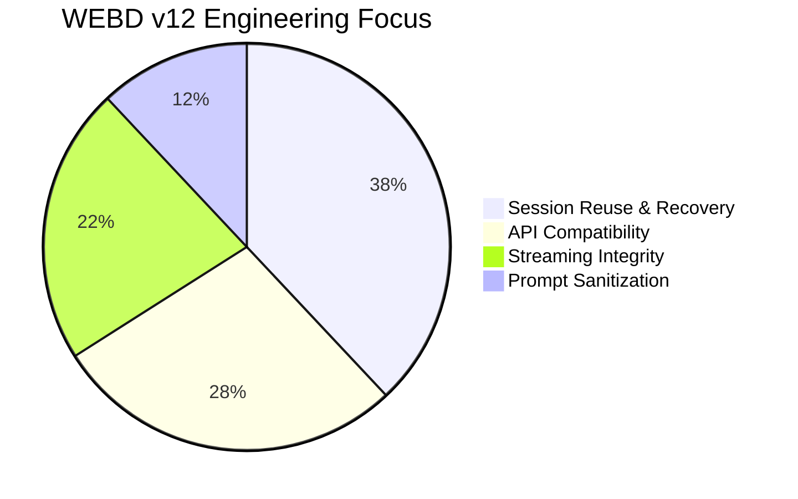
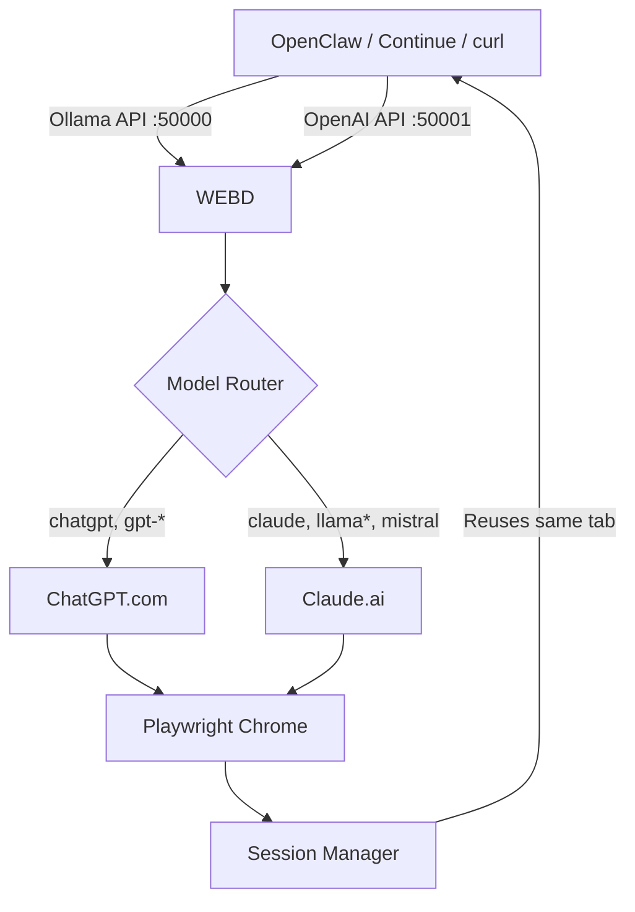

<p align="center">
    
</p>

<p align="center">
    
    
    
    
</p>

<p align="center">
    
</p>

<p align="center">
    
    
    
    
</p>

---

## 🎯 **What is WEBD in ONE sentence?**

> **WEBD lets you talk to ChatGPT and Claude through ANY app that supports Ollama or OpenAI type APIs — without API keys, without monthly fees, just your browser logged in once.**

---

## ⚡ **15-Second Pitch**

OpenClaw, Continue, Cline, or any Ollama/OpenAI client connects to `http://localhost:50000`. WEBD opens Chrome, navigates to ChatGPT or Claude, types your prompt, captures the response, and sends it back — **all automatically**. It remembers your chats, reuses tabs, auto-recovers when you close a tab, and falls back to ChatGPT if Claude hits daily limits.

**No API keys. No cloud costs. Just local AI.**

---

## 🧠 **What WEBD Does (Simple Version)**

| # | What |
|---|------|
| 1 | Starts two API servers on your computer |
| 2 | Ollama API → port `50000` (for OpenClaw, Continue, Ollama clients) |
| 3 | OpenAI API → port `50001` (for OpenAI-compatible clients) |
| 4 | Opens real Chrome browser (you see it typing!) |
| 5 | Routes `chatgpt` → ChatGPT.com, `claude` → Claude.ai |
| 6 | Remembers your conversation (reuses same chat tab) |
| 7 | Auto-detects closed tabs and opens fresh ones |
| 8 | Falls back to ChatGPT if Claude says "daily limit reached" |

---

## 🧪 **See It in Action**

```bash
# One command to test ChatGPT
curl -X POST http://localhost:50000/api/generate -H "Content-Type: application/json" -d "{\"model\":\"chatgpt\",\"prompt\":\"Say hello in 3 words\",\"stream\":false}"

# One command to test Claude
curl -X POST http://localhost:50000/api/generate -H "Content-Type: application/json" -d "{\"model\":\"claude\",\"prompt\":\"What is 2+2?\",\"stream\":false}"
```

**Expected output:** Your browser opens, types the prompt, and returns the AI's response in your terminal.

---

## 🚀 **Setup (Takes 2 Minutes)**

### Step 1: Install

```bash
pip install flask playwright playwright-stealth pystray pillow
playwright install
```

### Step 2: Login Once (Saves Forever)

```bash
python webd.py --setup
```
- Chrome opens to Claude.ai → login
- Then ChatGPT.com → login
- Press ENTER after each login

### Step 3: Run

```bash
python webd.py
```

**Done!** Your API gateway is running at:
- Ollama API: `http://localhost:50000`
- OpenAI API: `http://localhost:50001`

---

## 🔌 **OpenClaw Setup (Screenshot-Ready)**

| Setting | Value |
|---------|-------|
| Provider | Ollama |
| Base URL | `http://localhost:50000` |
| Model | `chatgpt` or `claude` |
| Streaming | ON (recommended) |

**That's it.** OpenClaw now talks to real ChatGPT/Claude through WEBD.

---

## 🧩 **Model Routing (Simple Table)**

| You type in model field | WEBD sends to |
|------------------------|---------------|
| `chatgpt`, `gpt-4`, `gpt-3.5` | ChatGPT.com |
| `claude`, `llama3`, `mistral`, `deepseek`, `qwen` | Claude.ai |
| anything else | ChatGPT.com (default) |

---

## 🩺 **Health Check (10 Seconds)**

```bash
curl http://localhost:50000/api/version
curl http://localhost:50000/api/tags
curl http://localhost:50001/v1/models
curl http://localhost:50000/sessions
```

---

## 📊 **Stability Score (What WEBD Focuses On)**



---

## 🎮 **All Available Endpoints (Quick Map)**

| Endpoint | Port | What it does |
|----------|------|---------------|
| `/api/generate` | 50000 | Single prompt → response |
| `/api/chat` | 50000 | Multi-turn conversation |
| `/api/tags` | 50000 | List available models |
| `/api/version` | 50000 | Version check |
| `/api/show` | 50000 | Model info |
| `/api/embeddings` | 50000 | Stub (returns zeros) |
| `/v1/chat/completions` | 50001 | OpenAI-compatible |
| `/v1/models` | 50001 | List OpenAI models |
| `/ask` | 50001 | Simple prompt endpoint |
| `/sessions` | Both | View active sessions |
| `/sessions/reset` | Both | Clear all chat history |

---

## 🧪 **Full API Examples**

### Ollama `/api/generate` (non-streaming)

```bash
curl -X POST http://localhost:50000/api/generate -H "Content-Type: application/json" -d "{\"model\":\"chatgpt\",\"prompt\":\"Explain APIs like I'm 10\",\"stream\":false}"
```

### Ollama `/api/generate` (streaming)

```bash
curl -N -X POST http://localhost:50000/api/generate -H "Content-Type: application/json" -d "{\"model\":\"chatgpt\",\"prompt\":\"Count to 10\",\"stream\":true}"
```

### Ollama `/api/chat` (conversation)

```bash
curl -X POST http://localhost:50000/api/chat -H "Content-Type: application/json" -d "{\"model\":\"claude\",\"messages\":[{\"role\":\"user\",\"content\":\"My name is Alex\"},{\"role\":\"assistant\",\"content\":\"Hi Alex!\"},{\"role\":\"user\",\"content\":\"What's my name?\"}],\"stream\":false}"
```

### OpenAI `/v1/chat/completions`

```bash
curl -X POST http://localhost:50001/v1/chat/completions -H "Content-Type: application/json" -H "Authorization: Bearer any-key" -d "{\"model\":\"chatgpt\",\"messages\":[{\"role\":\"user\",\"content\":\"Hi there\"}],\"stream\":false}"
```

---

## 🪟 **PowerShell Commands (Windows)**

```powershell
$body = @{ model='chatgpt'; prompt='Hello from PowerShell'; stream=$false } | ConvertTo-Json; Invoke-RestMethod -Uri 'http://localhost:50000/api/generate' -Method Post -ContentType 'application/json' -Body $body
```

---

## 🛠️ **Environment Variables (Tweak Behavior)**

| Variable | Default | What it does |
|----------|---------|---------------|
| `WEBD_OLLAMA_PORT` | 50000 | Change Ollama API port |
| `WEBD_OPENAI_PORT` | 50001 | Change OpenAI API port |
| `WEBD_PROVIDER_POLICY` | chatgpt_default | `chatgpt_only` = force all to ChatGPT |
| `WEBD_GENERATE_STATELESS` | 0 | `1` = new chat for every request |
| `WEBD_CHAT_PROMPT_MODE` | latest_user | `full` = send entire history |
| `WEBD_ENABLE_LOCAL_ACTIONS` | 0 | `1` = enable calculator/browser actions |

**Usage:** `set WEBD_OLLAMA_PORT=50050` (Windows) or `export WEBD_OLLAMA_PORT=50050` (Linux/Mac)

---

## 🐛 **Common Problems & Fixes**

| Problem | Fix |
|---------|-----|
| OpenClaw waits forever | Turn ON streaming in OpenClaw settings |
| "No user message found" | Check your prompt has text, not just images |
| Claude says "daily limit" | WEBD auto-falls back to ChatGPT + shows notice |
| Browser tab closed by accident | WEBD auto-detects and opens fresh tab |
| Port 50000 already in use | WEBD auto-increments to 50001, 50002... |
| Message didn't send | WEBD returns `[WEBD_SUBMIT_FAILED]` — retry once |

---

## 📁 **Files WEBD Creates**

| Path | What |
|------|------|
| `~/cybreign_browser_profile/` | Your Chrome profile (stays logged in) |
| `~/Desktop/AI_Responses/` | Screenshots and debug output |
| `~/cybreign_sessions.json` | Active session tracking |

---

## 🧑‍💻 **For Developers**

```python
# Python example using requests
import requests

response = requests.post(
    "http://localhost:50000/api/generate",
    json={"model": "chatgpt", "prompt": "Hello", "stream": False}
)
print(response.json()["response"])
```

```javascript
// JavaScript example
fetch("http://localhost:50000/api/generate", {
    method: "POST",
    headers: {"Content-Type": "application/json"},
    body: JSON.stringify({model: "chatgpt", prompt: "Hello", stream: false})
})
.then(res => res.json())
.then(data => console.log(data.response));
```

---

## 🎨 **Architecture (How It Works)**



---

## 📦 **Requirements**

| Requirement | Minimum |
|-------------|---------|
| OS | Windows 10/11 |
| Python | 3.10+ |
| Browser | Chrome (installed) |
| RAM | 512MB free |
| Internet | Yes (to reach ChatGPT/Claude) |

---

## 🤝 **Contributing**

PRs welcome! Areas to help:
- Add Gemini, Perplexity, or other providers
- Linux/macOS support
- Docker container
- Binary executable builds

---

## 📄 **License**

**GPL-3.0** — Free to use, modify, and distribute.

---

## 🌟 **Star History**

[](https://star-history.com/#cybreign/WEBD&Date)

---

<p align="center">
    
</p>

<p align="center">
    <b>WEBD v12 — The simplest way to add ChatGPT + Claude to any local AI app</b><br>
    <sub>No API keys. No subscriptions. Just your browser.</sub>
</p>
