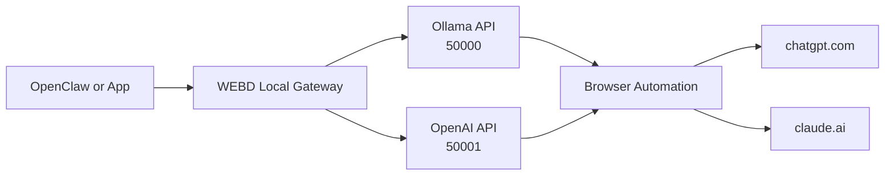
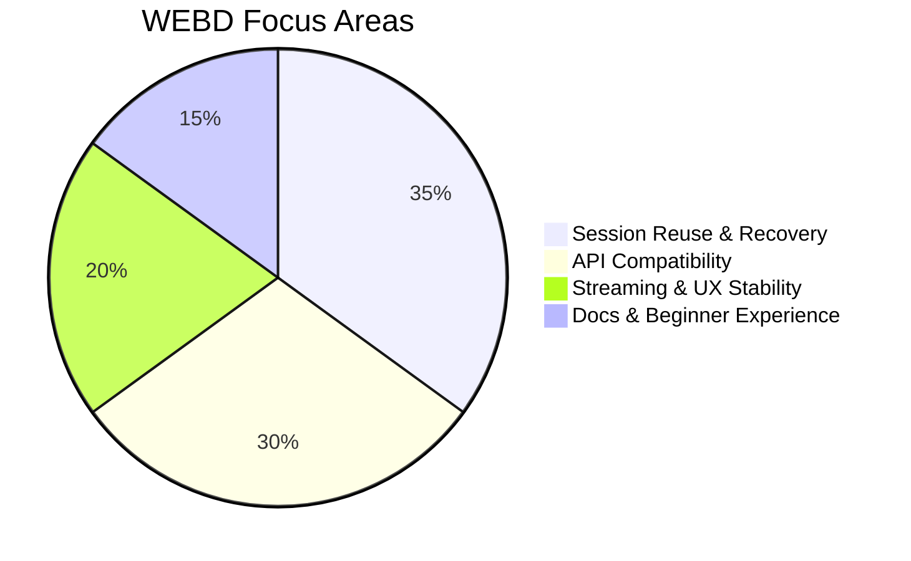

# WEBD


WEBD is a local bridge that lets your apps use ChatGPT and Claude using familiar API-style URLs.

Built for students, beginners, and developers who want a free local workflow.

## One-Look Summary

- Start WEBD on your laptop
- Connect OpenClaw once
- Ask from OpenClaw, response comes from ChatGPT or Claude
- Claude is used when Claude model is selected
- If Claude limit is hit, WEBD auto-falls back to ChatGPT with a notice

## Quick Visual



## Setup Options

### Option A: Download Binary (if release is available)

1. Open this repo on GitHub
2. Open Releases section
3. Download the latest Windows build
4. Run the executable

### Option B: Python Setup

Requirements:

- Windows
- Python 3.10+
- Chrome browser

Install:

```bash
pip install -r requirements.txt
playwright install
```

First-time login setup:

```bash
python webd.py --setup
```

Run:

```bash
python webd.py
```

## OpenClaw Setup (Very Important)

- Provider: Ollama
- Base URL: http://localhost:50000
- Model examples:
	- chatgpt
	- claude

Streaming tip:

- If OpenClaw feels like waiting for full response, enable streaming in OpenClaw provider/chat settings.
- Some OpenAI-style clients default stream to false unless explicitly enabled.

## Model Behavior

- Select chatgpt model -> WEBD sends to ChatGPT
- Select claude model -> WEBD sends to Claude first
- If Claude limit is detected -> WEBD falls back to ChatGPT
- Fallback is explicitly shown with WEBD NOTICE

## Standard Ports

- Ollama-compatible: 50000
- OpenAI-compatible: 50001

If busy, WEBD auto-increments to next free ports.

## Health Check

```bash
curl http://localhost:50000/api/version
curl http://localhost:50001/v1/models
```

## Feature Snapshot



## Demo Media (Put Your Files In assets)

- Screenshot 1: assets/photo1.png
- Screenshot 2: assets/photo2.png
- Video 1: assets/video1.mp4
- Video 2: assets/video2.mp4

Preview template:

```markdown


```

## Quick Troubleshooting

1. Old response repeats:
	 restart WEBD and retry once.
2. Message typed but not sent:
	 WEBD now returns explicit send-failed error; retry same prompt.
3. Curl JSON body errors:
	 use examples from [CURL_COMMANDS.md](CURL_COMMANDS.md).

## Essential Files

- [webd.py](webd.py)
- [CURL_COMMANDS.md](CURL_COMMANDS.md)
- [updated.md](updated.md)
- [assets/README.md](assets/README.md)

## License

GPL-3.0
