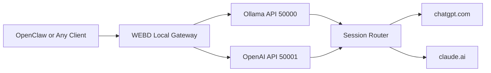
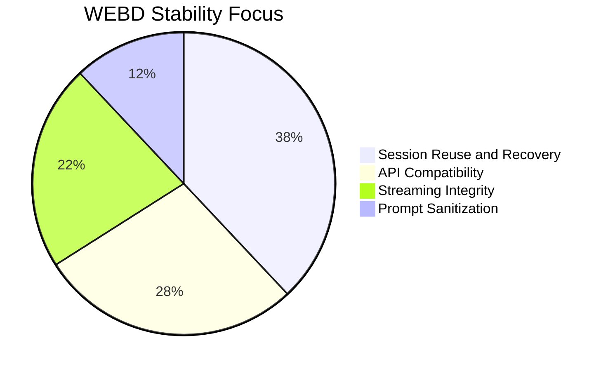

<p align="center">
    
</p>

<p align="center">
    
    
    
</p>

<p align="center">
    
</p>


## 15-Second Project Pitch

WEBD turns your local machine into a dual API bridge for ChatGPT and Claude. Connect OpenClaw or any Ollama/OpenAI-style client once, send prompts normally, and WEBD handles browser automation, provider routing, session reuse, and reliable fallback behavior for you.

## What WEBD Does

1. Exposes Ollama-compatible endpoints (starting at 50000)
2. Exposes OpenAI-compatible endpoints (starting at 50001)
3. Returns browser-backed responses from ChatGPT and Claude
4. Preserves session memory and reuses active non-full chats

## Latest Important Fixes

### 1. Main Session Reuse Fix (Claude to ChatGPT switch)

- ChatGPT now reuses the latest non-full active chat even if active index was lost.
- Added recovery logic to restore active session pointers before navigation.
- Prevents unnecessary new ChatGPT chats when switching back from Claude.

### 2. ChatGPT submit reliability

- Added submit-confirm checks after send click or Enter.
- Added alternate send retry path if first submit does not start generation.
- Returns explicit submit-failed message when send truly fails.

### 3. Stale and mixed response prevention

- Polling isolates assistant content generated after current submit baseline.
- Better delta handling when UI rewrites partial text during streaming.
- Prevents old plus new merged output patterns.

### 4. Claude routing correctness

- Explicit Claude model selection always routes to Claude first.
- Fallback to ChatGPT only on real Claude limit detection.
- Fallback includes clear WEBD notice text.

### 5. Prompt and OpenClaw stability

- Better multiline prompt preservation.
- Noise-wrapper sanitization improvements.
- Reduced fence/backtick contamination in forwarded prompts.

## Visual Architecture



## Setup Options

### Option A: Binary release (when available)

1. Open the GitHub repo
2. Go to Releases
3. Download the latest Windows build
4. Run the executable

### Option B: Python setup

Requirements:

- Windows
- Python 3.10+
- Chrome browser

Install and run:

```bash
pip install -r requirements.txt
playwright install
python webd.py --setup
python webd.py
```

## OpenClaw Quick Setup

1. Provider: Ollama
2. Base URL: http://localhost:50000
3. Model: chatgpt or claude

Streaming tip:

- If output appears only after full completion, enable streaming in OpenClaw.
- Some OpenAI-style clients default stream to false unless enabled explicitly.

## Runtime Defaults

- Ollama API default: 50000
- OpenAI API default: 50001
- Auto-increment to next free ports when busy
- Provider policy default: chatgpt_default
- Generate mode default: stateful session reuse

## Model Behavior

- Select chatgpt model: routes to ChatGPT
- Select claude model: routes to Claude first
- If Claude limit is detected: fallback to ChatGPT with WEBD notice

## Stability Snapshot



## Demo Media

- Screenshot 1: assets/photo1.png
- Screenshot 2: assets/photo2.png
- Video 1: assets/video1.mp4
- Video 2: assets/video2.mp4

## Quick Health Checks

```bash
curl http://localhost:50000/api/version
curl http://localhost:50001/v1/models
```

## Troubleshooting

1. If provider switching opens a new chat, verify old chat is still active and not full.
2. If response waits for full output, enable client-side streaming.
3. If send fails, retry once and check WEBD explicit error output.

## Essential Files

- [webd.py](webd.py)
- [webd.md](webd.md)
- [CURL_COMMANDS.md](CURL_COMMANDS.md)
- [assets/README.md](assets/README.md)

## License

GPL-3.0
