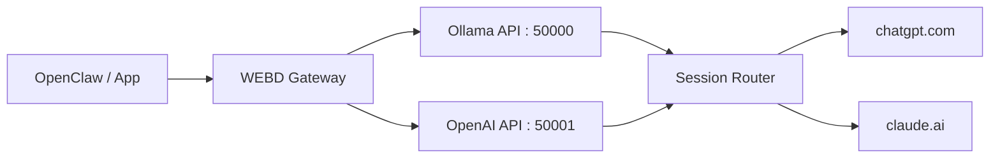
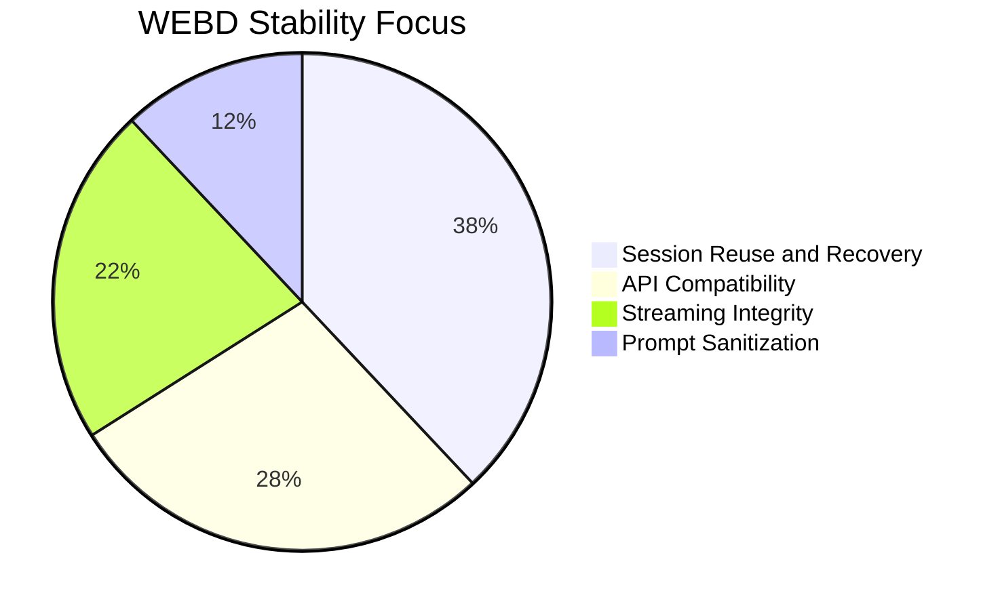

# WEBD

<p align="center">
  
</p>

<p align="center">
  
  
  
</p>

<p align="center">
  
</p>

## What WEBD Does

WEBD is a local bridge that gives you:

1. Ollama-compatible endpoints on port 50000
2. OpenAI-compatible endpoints on port 50001
3. Browser-backed responses from ChatGPT and Claude
4. Smart provider routing and session reuse

## Latest Fixes (Merged Update)

### 1. Main Session Reuse Fix (Claude to ChatGPT switch)

- ChatGPT now reuses the latest non-full active chat even if active index was lost.
- Added recovery logic to restore active session pointers before navigation.
- Prevents unnecessary new ChatGPT chats when switching back from Claude.

### 2. ChatGPT submit reliability

- Added submit-confirm checks after send click/Enter.
- Added alternate send retry path if first submit does not start generation.
- Returns explicit submit-failed message when send truly fails.

### 3. Stale response and mixed response prevention

- Polling now isolates assistant content generated after current submit baseline.
- Improved delta handling for UI text rewrites during streaming.
- Avoids old plus new merged output patterns.

### 4. Claude routing correctness

- Explicit Claude model selection always routes to Claude first.
- Fallback to ChatGPT only on real Claude limit detection.
- Fallback includes clear WEBD notice text.

### 5. Prompt and OpenClaw stability

- Better multiline prompt preservation.
- Wrapper/noise sanitization improvements.
- Reduced fence/backtick contamination in forwarded prompts.

## Flowing Architecture



## Setup

### Python setup

```bash
pip install -r requirements.txt
playwright install
python webd.py --setup
python webd.py
```

### OpenClaw setup

1. Provider: Ollama
2. Base URL: http://localhost:50000
3. Model: chatgpt or claude

## Runtime Defaults

- Ollama API default: 50000
- OpenAI API default: 50001
- Auto-increment to next free ports if occupied
- Provider policy default: chatgpt_default
- Generate mode default: stateful chat reuse

## Visual Progress Snapshot



## Demo Section

- Screenshot 1: assets/photo1.png
- Screenshot 2: assets/photo2.png
- Video 1: assets/video1.mp4
- Video 2: assets/video2.mp4

## Quick Checks

```bash
curl http://localhost:50000/api/version
curl http://localhost:50001/v1/models
```

## Troubleshooting

1. If provider switching still opens new chat, verify the previous chat is not full and still active.
2. If response waits for full output, enable streaming in your client settings.
3. If ChatGPT send fails, retry once and watch for WEBD explicit error message.

## Key Files

- webd.py
- webd.md
- CURL_COMMANDS.md
- assets/README.md

## License

GPL-3.0
